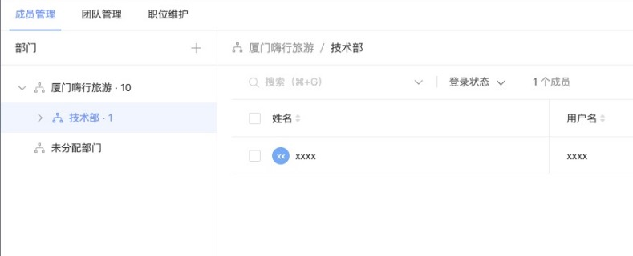

# Hixtrip FE Online

## 准备

- fork 此仓库
- 根据如下要求实现相关代码
- 完成要求
  - 提交`pull request`
  - 提供页面截图

## 需求

1. 目前已经有`src/api/user.ts` 以及 `src/api/org.ts` 两个 API
2. 需要实现如下效果界面：



> 功能要求：
- 不限 ```React``` 或者 ```Vue```
- 需要拆分 `OrgTree` 以及 `UserTable` 两个组件
  - 两个组件自己维护相关的数据。
  - 体现两个组件的互相通信。
- 组织架构根据点上级节点进行查询子级节点实现异步加载。
- 用户 ```Table ``` 数据跟据点击 ```组织架构树形节点``` 以及 ```输入搜索关键字``` 查询。
  - 需要考虑防抖节流等功能点
- 风格不限
  - 示例图仅仅是效果展示，不需要完全符合。
  - 可以使用 ```UI Framework```, 如 ```ant-design```, ```element-ui```等
  - 如果不用```UI Framework```, 可以直接用原生的```<ul> <li>```, ```<table>``` 实现，不用实现相关的CSS样式, 可以加分。

## 其他简答题

### 如何将如下的`JSON`正确解析成 `Object`
```json
{
  "userId": 111323290434354540545
}


解答： const jsonString = '{"userId": 111323290434354540545}';
      const jsonObject = JSON.parse(jsonString);
      console.log(jsonObject.userId); // 输出 111323290434354540545


```
### 前端需要*稳定*每隔`1s`向服务端请求`API`, 请问如何实现？
function fetchData() {
  fetch(URL)
    .then(response => response.json())
    .then(data => {
        // 处理从服务端返回的数据
        console.log(data);
    })
    .catch(error => {
        // 处理请求失败的情况
        console.error('Error fetching data:', error);
    });
}

// 每隔1秒调用fetchData函数
setInterval(fetchData, 1000);


### 什么情况下，你会为你的项目引入状态管理库，比如`Redux`, `Pinia`, 可以简述一下起到了什么作用么？
答：我认为当应用的状态需要在多个组件之间共享和同步时，使用状态管理库可以更方便地管理和更新状态，而不必通过繁琐的 props 层层传递数据。

### 为什么`ESM`与`CJS`不能兼容？
答：ESM是es6以后实现的前端模块化，而CJS规范主要用于服务端编程（Node）,它两是两种不同的模块系统，有不同的语法和加载方式，因此不能直接兼容。在语法上ESM 使用 import 和 export 关键字来导入和导出模块，而 CJS 使用 require() 和 module.exports 或 exports 来导入和导出模块。这两种语法不兼容，无法直接在同一个模块中混用。还有就是 ESM 是在编译时静态解析模块依赖的，而 CJS 是在运行时动态加载模块的。ESM 在代码执行之前就会进行模块的解析和加载，而 CJS 则在运行时根据代码的执行情况来加载模块。这种加载方式的差异导致了它们无法直接兼容。